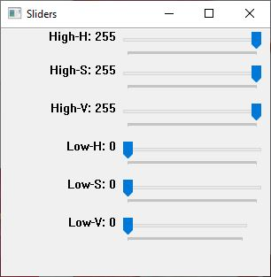
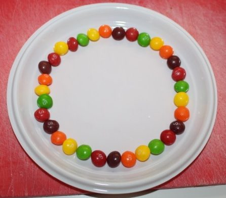
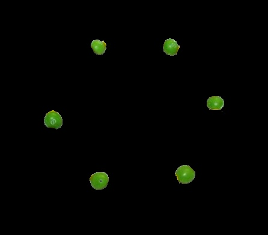
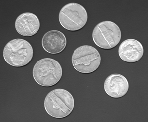
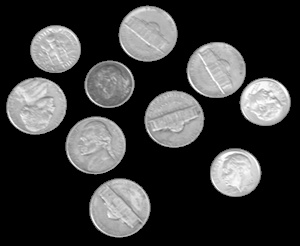
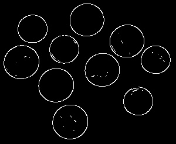

# OpenCV-Segmentation-Slider

This tool helps in finding the optimal color space values that will segment an object in an image. The tool uses sliders to adjust the values in different color spaces. The program works with BGR, HSV, LAB and Binaary color space. The program also has a canny edge slider.

## Usage

In order to use the tool import the ```Sliders``` class from the Sliders.py file and then create an instance of it as follows:

```
slider = Sliders("Images/skittles.jpg", slider_type = "HSV", image_scale = 1, num_blur_passes = 1, blur_filter_size = (3, 3))
```

Running the following command will start the program and the sliders will appear:

```
slider.Start_Slider_Display()
```

The sliders window will show up. Move the sliders until the desired object is segmented.



## Examples
### HSV Slider

The HSV sliders can be used to segment a single colored object from a group of differently colored object. The following image contains differently colored objects.



If the HSV sliders are adjusted properly we can segment out the green skittles as shown below.



### Binary Slider

Given the following image.



The slider can be adjusted in such a way that the grayscale image is binarized and the coins are segmented out of the image.



### Canny Slider

The canny sliders can be adjusted to get the optimal edges out of the images.


